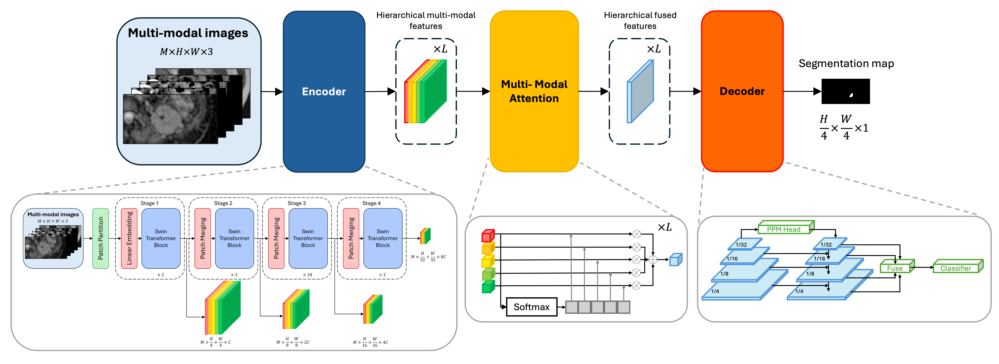

# Multi-Modal-Medical-Image-Attention

Implementation of our published multi-modal attention framework for **medical image segmentation**, built on Transformer architectures from the Hugging Face ecosystem. The proposed method enables effective feature fusion across multiple imaging modalities while dynamically adapting to missing modalities by excluding them during computation.

📄 **Paper**: https://ieeexplore.ieee.org/document/11230342  
⚠️ **Note**: The dataset is not included due to privacy restrictions.

---

## Overview
Medical image segmentation is a fundamental task for clinical diagnosis and treatment planning. Leveraging multiple imaging modalities (e.g., CT, MRI) can significantly improve segmentation performance by providing complementary information. However, many existing approaches assume fixed modality availability or rely on imputation when modalities are missing.

In this work, we propose a **Transformer-based multi-modal attention framework** that performs adaptive cross-modal feature fusion. The model dynamically adjusts to the available modalities by **excluding missing inputs from computation**, allowing it to operate under varying modality conditions without introducing artificial signals such as zero-filling.

---

## Model Architecture



The framework consists of:
- Modality-specific feature encoding
- Transformer-based attention for cross-modal interaction
- Dynamic exclusion of missing modalities during attention computation
- A segmentation head for final prediction

---

## Key Features
- Transformer-based multi-modal attention (Hugging Face backbone)
- Designed primarily for **medical image segmentation**
- Native handling of missing modalities (no imputation or masking tricks)
- Dynamic multi-modal input dimension during training and inference
- Robust cross-modal feature fusion

---

## Use Case
This framework targets **multi-modal medical image segmentation**, where:
- Multiple modalities provide complementary information
- Some modalities may be unavailable in real-world scenarios

The model:
- Utilizes all available modalities when present  
- Maintains stable performance when modalities are missing  

---

## Dataset
The dataset used in our paper is **not publicly available** due to privacy restrictions.

To use this code:
- Prepare your own segmentation dataset
- Provide dataset split files in CSV format:
  - `train.csv`
  - `val.csv`
  - `test.csv`

### CSV Format

The dataset must be defined using CSV files (`train.csv`, `val.csv`, `test.csv`) with the following structure.

**Important:**  
Segmentation maps must be included in the same CSV and are identified by appending the letter **`L`** to the corresponding modality name.

| Column        | Description                                      |
|--------------|--------------------------------------------------|
| Unnamed: 0   | Row index (optional, can be ignored)             |
| ID           | Patient or case identifier                       |
| Modality     | Imaging modality name                            |
| Data         | Image file name                                  |
| Data path    | Full or relative path to the image file          |

### Example

```csv
Unnamed: 0,ID,Modality,Data,Data path
0,15630104,am,1.png,dataset/resized_dataset_divisible/15630104/am/1.png
1,15630104,am,2.png,dataset/resized_dataset_divisible/15630104/am/2.png
2,15630104,amL,1.png,dataset/resized_map_divisible/15630104/amL/1.png
3,15630104,amL,2.png,dataset/resized_map_divisible/15630104/amL/2.png
```

---

## Usage
```bash
python train.py \
  --csv_train <path_to_train_csv> \
  --csv_val <path_to_val_csv> \
  --csv_test <path_to_test_csv>